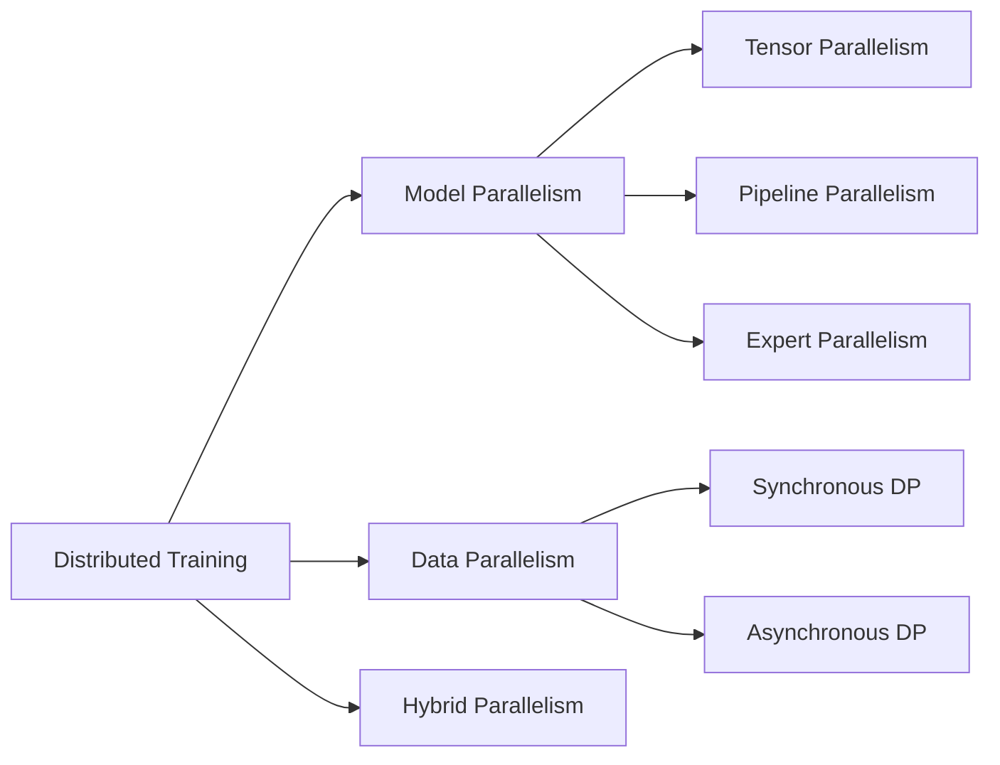

# Why Distributed System for LLM?
LLMs require distributed systems due to their **scale** — in both memory and compute.

1. **Too Large to Fit**  
   LLMs like GPT-4.5 (~5–7T params) need ~10-14 TB (5 or 7TB * 2 bytes) memory just for weights in `bf16`. Training also requires memory for gradients, optimizer states, activations, etc. Far beyond the 80 GB memory limit of an H100 GPU.

2. **Too Expensive to Run**  
   Training involves massive data and compute. Transformer self-attention computation complexity scales quadratically with sequence length:  `O(n^2 · d)`. A single device can't handle this efficiently - distributed compute is essential. 
   
   **Example:**  
   Suppose we train a 1T-parameter model on 300B tokens. Assuming 6 FLOPs per param per token (2 forward, 4 backward), the total compute is:

   Total FLOPs = 10¹² × 6 × 3 × 10¹¹ = 1.8 × 10²⁴

   A single H100 GPU offers ~10¹⁵ FLOPs/sec (1000 TFLOPs). Time required:

   1.8 × 10²⁴ / 10¹⁵ = 1.8 × 10⁹ seconds ≈ 57.1 years

# Measurement
When introducing a new approach for parallelism and distributed systems in LLMs, we can evaluate performance using these key metrics:

| Evaluation Metrics         | Examples                                             |
|----------------------------|------------------------------------------------------|
| **Throughput**             | Tokens per second (`time.perf_counter()`)            |
| **Latency**                | Single-step timing, GPU/TPU trace                    |
| **Device Utilization**     | GPU utilization, TPU profiler    |
| **Communication Overhead** | Percentage of `all-reduce`, `all-gather` operations  |
| **Model Accuracy**         | PPL, Accuracy, F1-score       |                           |

# Distributed Training

## Model Parallelism

### Tensor Parallelism
Tensor parallelism is used when individual operations in a model involve matrices with tremendous numbers of parameters. In the attention mechanism, for example, we split the query, key, and value projection matrices column-wise across devices. Each device computes its portion of the attention computation, and the results are combined using collective communication operations like all-reduce or all-gather.

**Example:**

Matrix computation `y = x * W` where `W` is too large to fit on a single GPU. Matrix `W`: shape `(4096, 4096)`. Input `x`: shape `(1, 4096)`. Target: 4 GPUs available. 

**Partition the weight matrix**: Split `W` column-wise across 4 GPUs
- GPU 0: `W1` with shape `(4096, 1024)`
- GPU 1: `W2` with shape `(4096, 1024)` 
- GPU 2: `W3` with shape `(4096, 1024)`
- GPU 3: `W4` with shape `(4096, 1024)`

**Parallel computation**: Each GPU computes its portion simultaneously
- GPU 0: y1 = x * W1  → output shape (1, 1024)
- GPU 1: y2 = x * W2  → output shape (1, 1024)
- GPU 2: y3 = x * W3  → output shape (1, 1024)
- GPU 3: y4 = x * W4  → output shape (1, 1024)

**Combine results**: Concatenate partial outputs to form the complete result y = [y1, y2, y3, y4]  → final shape (1, 4096)

### Pipeline Parallelism

Definition: Pipeline parallelism is used for models with many layers. We split the layers vertically into stages, with each device responsible for computing a specific stage. Batch data flows sequentially through the stages to complete the full forward pass.

**Example:**

### Expert Parallelism  

**Example:**
    
## Data Parallelism
### Synchronous DP
### Asynchronous DP

# Distributed Serving

# Code in Jax

# Code in Pytorch