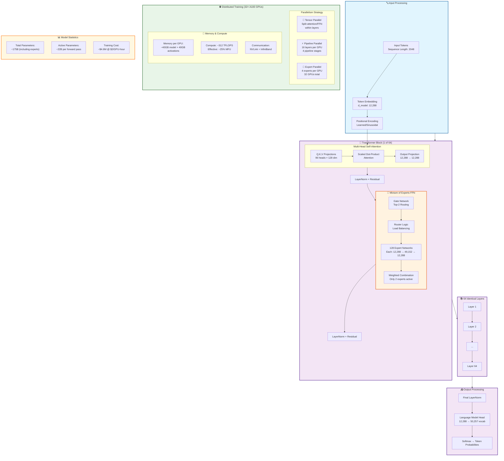

## Goal
This post provides a detailed visual breakdown of a 175B parameter Mixture of Experts (MoE) Transformer architecture.

## Diagram

```mermaid
graph TB
    %% Input Processing
    subgraph Input_Processing ["🔤 Input Processing"]
        direction TB
        Tokens[Input Tokens<br/>Sequence Length: 2048] --> Embed[Token Embedding<br/>d_model: 12,288]
        Embed --> PosEnc[Positional Encoding<br/>Learned/Sinusoidal]
    end

    %% Single Transformer Block Detail
    subgraph Single_Block ["🧠 Transformer Block (1 of 64)"]
        direction TB
        
        %% Self-Attention
        subgraph SelfAttn_Detail ["Multi-Head Self-Attention"]
            direction LR
            QKV["Q,K,V Projections<br/>96 heads × 128 dim"] 
            QKV --> ScaledDot["Scaled Dot-Product<br/>Attention"]
            ScaledDot --> AttnProj["Output Projection<br/>12,288 → 12,288"]
        end
        
        %% MoE FFN
        subgraph MoE_Detail ["🎯 Mixture of Experts FFN"]
            direction TB
            Gate["Gate Network<br/>Top-2 Routing"] --> Router["Router Logic<br/>Load Balancing"]
            Router --> ExpertGrid["128 Expert Networks<br/>Each: 12,288 → 49,152 → 12,288"]
            ExpertGrid --> Combine["Weighted Combination<br/>Only 2 experts active"]
        end
        
        %% Layer connections
        PosEnc --> SelfAttn_Detail
        SelfAttn_Detail --> Norm1["LayerNorm + Residual"]
        Norm1 --> MoE_Detail  
        MoE_Detail --> Norm2["LayerNorm + Residual"]
    end

    %% Stack indication
    subgraph Layer_Stack ["📚 64 Identical Layers"]
        direction TB
        L1["Layer 1"] --> L2["Layer 2"] --> Dots["..."] --> L64["Layer 64"]
    end

    %% Output
    subgraph Output_Processing ["📤 Output Processing"]
        direction TB
        FinalNorm["Final LayerNorm"] --> LMHead["Language Model Head<br/>12,288 → 50,257 vocab"]
        LMHead --> Softmax["Softmax → Token Probabilities"]
    end

    %% Distributed System Architecture
    subgraph Distributed_Arch ["🌐 Distributed Training (32× A100 GPUs)"]
        direction TB
        
        subgraph Parallelism_Strategy ["Parallelism Strategy"]
            direction LR
            TP["🔀 Tensor Parallel<br/>Split attention/FFN<br/>within layers"]
            PP["⚡ Pipeline Parallel<br/>16 layers per GPU<br/>4 pipeline stages"]  
            EP["🎯 Expert Parallel<br/>4 experts per GPU<br/>32 GPUs total"]
        end
        
        subgraph Memory_Compute ["💾 Memory & Compute"]
            direction TB
            Mem["Memory per GPU:<br/>~40GB model + 40GB activations"]
            Compute["Compute: ~312 TFLOPS<br/>Effective: ~25% MFU"]
            Comm["Communication:<br/>NVLink + InfiniBand"]
        end
    end

    %% Main flow connections
    Input_Processing --> Single_Block
    Single_Block --> Layer_Stack
    Layer_Stack --> Output_Processing
    
    %% Model statistics
    subgraph Model_Stats ["📊 Model Statistics"]
        direction TB
        TotalParams["Total Parameters:<br/>~175B (including experts)"]
        ActiveParams["Active Parameters:<br/>~22B per forward pass"]
        TrainingCost["Training Cost:<br/>~$4.6M @ $2/GPU-hour"]
    end

    %% Styling
    classDef inputStyle fill:#e1f5fe,stroke:#01579b,stroke-width:2px
    classDef blockStyle fill:#f3e5f5,stroke:#4a148c,stroke-width:2px  
    classDef moeStyle fill:#fff3e0,stroke:#e65100,stroke-width:2px
    classDef distStyle fill:#e8f5e8,stroke:#1b5e20,stroke-width:2px
    classDef statsStyle fill:#fff8e1,stroke:#ff6f00,stroke-width:2px

    class Input_Processing inputStyle
    class Single_Block,Layer_Stack,Output_Processing blockStyle
    class MoE_Detail moeStyle
    class Distributed_Arch distStyle
    class Model_Stats statsStyle
```
