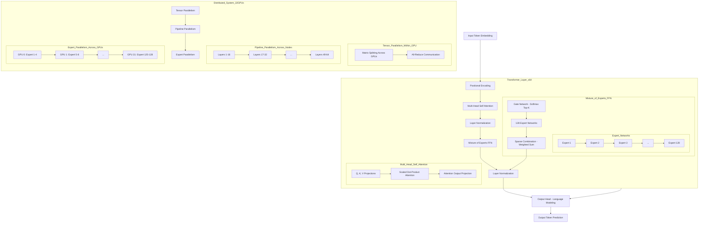

## Goal
Illustrate a 175B MoE Transformer Architecture to understand the model and infra details.

## Diagram

```mermaid
graph TD

%% 输入和嵌入层
Input[Input Token Embedding] --> PosEnc[Positional Encoding]

%% Transformer层 - 单个示例（实际堆叠多层）
subgraph Transformer_Layer_x64
direction TB

PosEnc --> SelfAttn[Multi-Head Self Attention]

%% Self-Attention细节
subgraph Multi_Head_Self_Attention
direction LR
QKV[Q, K, V Projections] --> AttnCalc[Scaled Dot-Product Attention] --> AttnOut[Attention Output Projection]
end

SelfAttn --> AttnNorm[Layer Normalization]

%% MoE FFN模块
AttnNorm --> MoEFFN[Mixture of Experts FFN]

subgraph Mixture_of_Experts_FFN
direction TB

GateNetwork[Gate Network - Softmax Top-K] --> Experts[128 Expert Networks]

subgraph Expert_Networks
direction LR
E1[Expert 1] --> E2[Expert 2] --> E3[Expert 3] --> dots1[...] --> E128[Expert 128]
end

Experts --> SparseCombine[Sparse Combination - Weighted Sum]
end

MoEFFN --> FFNNorm[Layer Normalization]

end

%% 输出层
Transformer_Layer_x64 --> OutputHead[Output Head - Language Modeling]

OutputHead --> Final[Output Token Prediction]

%% 并行细节和GPU分布
subgraph Distributed_System_32GPUs
direction TB

TP[Tensor Parallelism] --> PP[Pipeline Parallelism] --> EP[Expert Parallelism]

subgraph Tensor_Parallelism_Within_GPU
direction LR
MatSplit[Matrix Splitting Across GPUs] --> AllReduce[All-Reduce Communication]
end

subgraph Pipeline_Parallelism_Across_Nodes
direction LR
Layer1_16[Layers 1-16] --> Layer17_32[Layers 17-32] --> dots2[...] --> Layer49_64[Layers 49-64]
end

subgraph Expert_Parallelism_Across_GPUs
direction LR
GPU0[GPU 0: Expert 1-4] --> GPU1[GPU 1: Expert 5-8] --> dots3[...] --> GPU31[GPU 31: Expert 125-128]
end

end

%% 明确流程链接
SparseCombine --> FFNNorm
FFNNorm --> OutputHead
```
