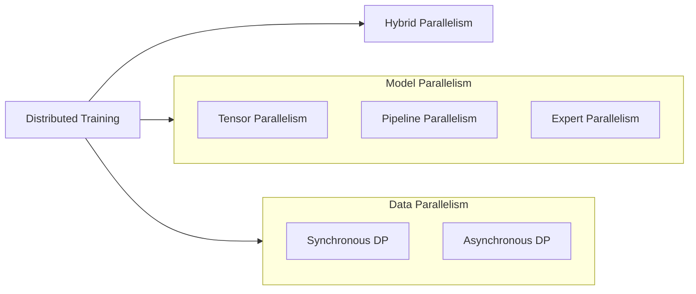
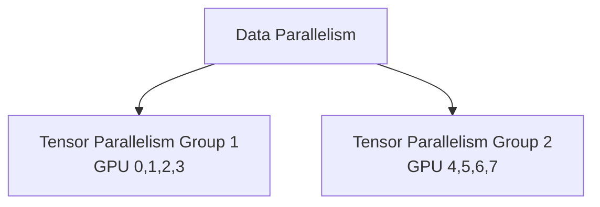
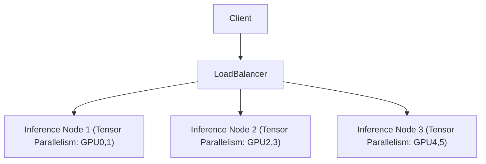

## Why Distributed System for LLM?
LLMs require distributed systems due to their **scale** — in both memory and compute.

1. **Too Large to Fit**  
   LLMs like GPT-4.5 (~5–7T params) need ~10-14 TB (5 or 7TB * 2 bytes) memory just for weights in `bf16`. Training also requires memory for gradients, optimizer states, activations, etc. Far beyond the 80 GB memory limit of an H100 GPU.

2. **Too Expensive to Run**  
   Training involves massive data and compute. Transformer self-attention computation complexity scales quadratically with sequence length:  `O(n^2 · d)`. A single device can't handle this efficiently - distributed compute is essential. 
   
   **Example:**  
   Suppose we train a 1T-parameter model on 300B tokens. Assuming 6 FLOPs per param per token (2 forward, 4 backward), the total compute is:

   Total FLOPs = 10¹² × 6 × 3 × 10¹¹ = 1.8 × 10²⁴

   A single H100 GPU offers ~10¹⁵ FLOPs/sec (1000 TFLOPs). Time required:

   1.8 × 10²⁴ / 10¹⁵ = 1.8 × 10⁹ seconds ≈ 57.1 years

## Distributed Training

### Model Parallelism

| **Parallelism Method** | **Dimension** | **Use Case** | **Characteristics** | **Representative Framework** |
|---|---|---|---|---|
| **Tensor Parallel** | Within single layer operators | Single layer too large | Parameter/computation parallel, high-frequency communication | Megatron-LM |
| **Pipeline Parallel** | Vertical model partitioning | Deep models | Stage-wise execution, pipeline bubble issues | GPipe |
| **Expert Parallel** | Multiple expert modules within layer | MoE architecture models | Large capacity, sparse computation, efficient | Switch Transformer, GShard |

#### Tensor Parallelism
Tensor parallelism is used when individual operations in a model involve matrices with tremendous numbers of parameters. In the attention mechanism, for example, we split the query, key, and value projection matrices column-wise across devices. Each device computes its portion of the attention computation, and the results are combined using collective communication operations like all-reduce or all-gather.

**Example:**

Matrix computation `y = x * W` where `W` is too large to fit on a single GPU. Matrix `W`: shape `(4096, 4096)`. Input `x`: shape `(1, 4096)`. Target: 4 GPUs available. 

**Partition the weight matrix**: Split `W` column-wise across 4 GPUs
- GPU 1: `W1` with shape `(4096, 1024)`
- GPU 2: `W2` with shape `(4096, 1024)` 
- GPU 3: `W3` with shape `(4096, 1024)`
- GPU 4: `W4` with shape `(4096, 1024)`

**Parallel computation**: Each GPU computes its portion simultaneously
- GPU 1: y1 = x * W1  → output shape (1, 1024)
- GPU 2: y2 = x * W2  → output shape (1, 1024)
- GPU 3: y3 = x * W3  → output shape (1, 1024)
- GPU 4: y4 = x * W4  → output shape (1, 1024)

**Combine results**: Concatenate partial outputs to form the complete result y = [y1, y2, y3, y4]  → final shape (1, 4096)

#### Pipeline Parallelism

Pipeline parallelism is used for models with many layers. We split the layers vertically into stages, with each device responsible for computing a specific stage. Batch data flows sequentially through the stages to complete the full forward pass.

**Example:**

Assume our Transformer model has 24 layers. We partition them into 4 pipeline stages across 4 available GPUs, with each stage containing 6 consecutive layers.

**Partition the layers**:
- GPU 1: Layer 1-6 (Stage 1)
- GPU 2: Layer 7-12 (Stage 2)
- GPU 3: Layer 13-18 (Stage 3)
- GPU 4: Layer 19-24 (Stage 4)

**Pipeline computation**:
- Batch 1 is processed by GPU 1 through layers 1-6, then the intermediate results are passed to GPU 2
- While GPU 2 processes Batch 1 through layers 7-12, GPU 1 begins processing Batch 2 through layers 1-6
- This pipeline continues: each GPU processes its assigned layers for one batch while simultaneously receiving intermediate results from the previous stage
- Notice we may have the pipeline bubble issue. In pipeline parallelism, GPUs must wait for data from previous stages, creating unavoidable idle periods. More micro-batches and process multiple batches simultaneously can reduce bubble ratio. 

#### Expert Parallelism  
When LLMs utilize the Mixture-of-Experts (MoE) architecture, we can distribute experts across different devices to enable parallel computation.

**Example:**

Assume a MoE layer contains 16 experts, where each expert is an individual Feed-Forward Network (FFN).

**Partition the experts**:
- GPU 1: Expert 1-4
- GPU 2: Expert 5-8
- GPU 3: Expert 9-12
- GPU 4: Expert 13-16

**Parallel computation**:
When input tokens pass through the MoE layer, the routing mechanism determines which expert(s) should process each token. For example, if the router decides that a particular token should be processed by Expert 5, only GPU 2 receives and computes that token. Different tokens in the same batch may be routed to different experts, allowing multiple GPUs to work simultaneously on different portions of the batch.
    
### Data Parallelism

Data Parallelism distributes training data across multiple devices while keeping identical model copies on each device. Each device processes different data batches and shares gradient updates to keep models synchronized.

#### Synchronous DP

- All devices process different data batches simultaneously
- After computing gradients, devices wait for all others to finish
- Gradients are aggregated (typically via all-reduce) across all devices
- Model parameters are updated simultaneously on all devices
- Next iteration begins only after all devices are synchronized

#### Asynchronous DP
- Each device processes data and updates parameters independently
- No waiting for other devices to finish
- Gradients are sent to parameter servers when ready
- Devices fetch latest parameters when available (may be stale)
- Different devices can be at different training steps

### Hybrid Parallelism
In practice, we typically combine multiple parallelism strategies to efficiently train  LLMs. The most common approach combines data parallelism and model parallelism.

**Example**
Assume we have 8 GPUs arranged in a 2×4 configuration:
- 2 data parallel groups (replicas)
- 4 GPUs per tensor parallel group (model sharding within each replica)

- Step 1: Data Parallelism
    - Split the input batch into 2 sub-batches. 
    - Each tensor parallelism group processes one sub-batch independently.
- Step 2: Model Computation
    - Within each 4-GPU group, model parameters are sharded across GPUs. Each GPU computes its portion of the forward/backward pass
- Step 3: Intra-group Gradient Synchronization
    - Within each tensor parallel group, aggregate gradients across the 4 GPUs
- Step 4: Inter-group Gradient Synchronization
    - Perform all-reduce across the 2 groups to synchronize gradients globally

### Measurement
When introducing a new approach for parallelism and distributed systems in LLMs, we can evaluate performance using these key metrics:

| Evaluation Metrics         | Examples                                             |
|----------------------------|------------------------------------------------------|
| **Throughput**             | Tokens per second (`time.perf_counter()`)            |
| **Latency**                | Single-step timing, GPU/TPU trace                    |
| **Device Utilization**     | GPU utilization, TPU profiler    |
| **Communication Overhead** | Percentage of `all-reduce`, `all-gather` operations  |
| **Model Accuracy**         | PPL, Accuracy, F1-score       |                           |

| **Method** | **Throughput** | **Latency** | **GPU/TPU Utilization** | **Communication Overhead** | **Accuracy** |
|---|---|---|---|---|---|
| **Tensor Parallel** | ↑ Significant boost | ↓ Reduced | ↑ Improved | High (all-reduce intensive) | No impact |
| **Pipeline Parallel** | ↑ Improved (notable for deep models) | ↑ Increased (pipeline bubbles) | Medium (pipeline idle time) | Medium (inter-stage comm) | No impact |
| **Expert Parallel** | ↑ Improved (sparse computation) | ↔ Minimal change | Balanced | High (all-to-all intensive) | ↑ Improved (larger capacity) |

## Distributed Serving

The distributed system during Serving is different than Training because

| **Aspect** | **Training** | **Serving** |
|---|---|---|
| **Data Processing** | Large batch data | Real-time single/small batch data |
| **Latency Requirements** | Low latency priority, focuses on throughput | Extremely high latency requirements |
| **Memory Management** | Stores parameters, gradients, optimizer states | Only model parameters, no gradients/optimizer |
| **Elastic Scaling** | Fixed scale, infrequent scaling | Rapid auto-scaling based on traffic |
| **Resource Utilization** | Emphasizes high resource saturation | Emphasizes response speed and flexibility |

## Code in Jax

## Code in Pytorch
