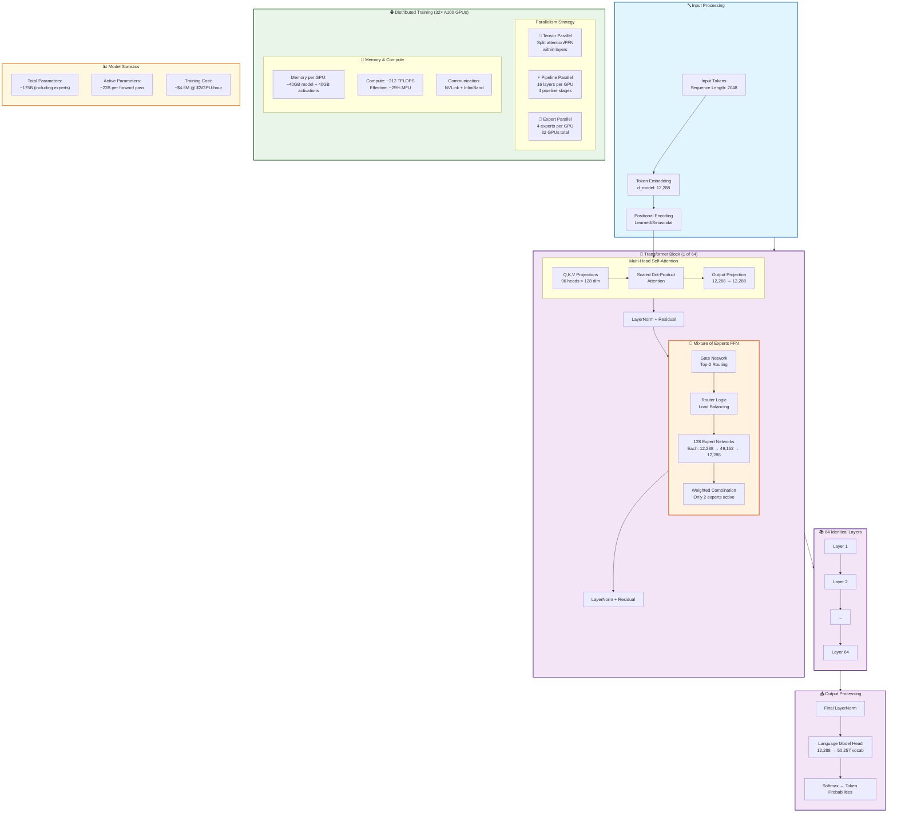
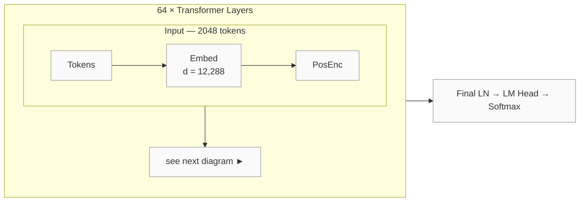
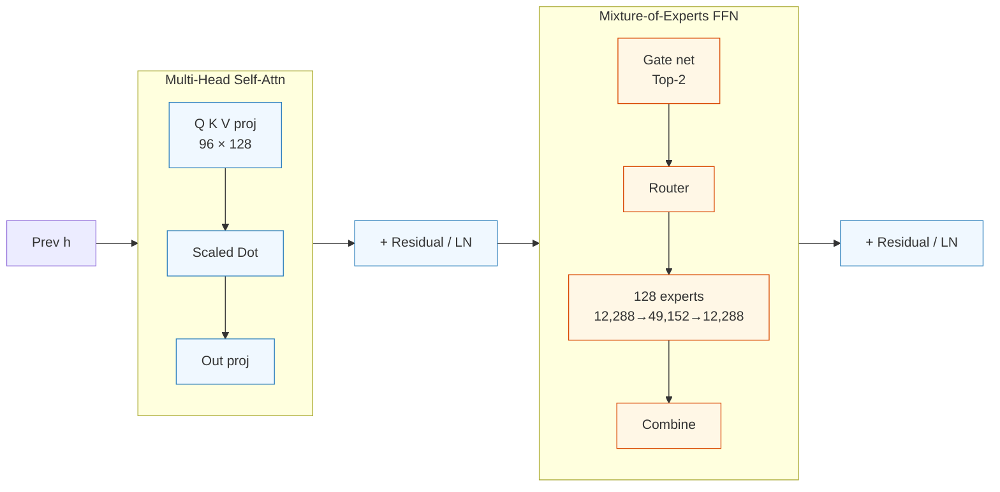
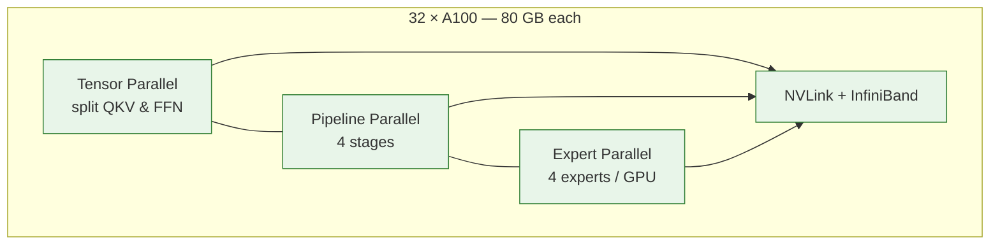

## Goal
This post provides a detailed visual breakdown of a 175B parameter Mixture of Experts (MoE) Transformer architecture.

## Diagram

### 🗺️ Model-level flow

### 🔍 Single Transformer Layer

### 🌐 Parallelism & Cluster Layout

