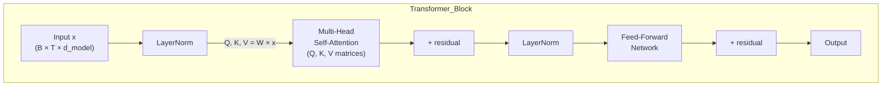

# Hello World! 🚀

```mermaid
graph TD
    subgraph Transformer_Block
        A["Input x<br/>(B × T × d_model)"] --> LN1["LayerNorm"]
        LN1 -->|"Q, K, V = W × x"| Attn["Multi-Head<br/>Self-Attention<br/>(Q, K, V matrices)"]
        Attn --> Add1["+ residual"]
        Add1 --> LN2["LayerNorm"]
        LN2 --> FFN["Feed-Forward<br/>Network"]
        FFN --> Add2["+ residual"]
        Add2 --> Output["Output"]
    end
```